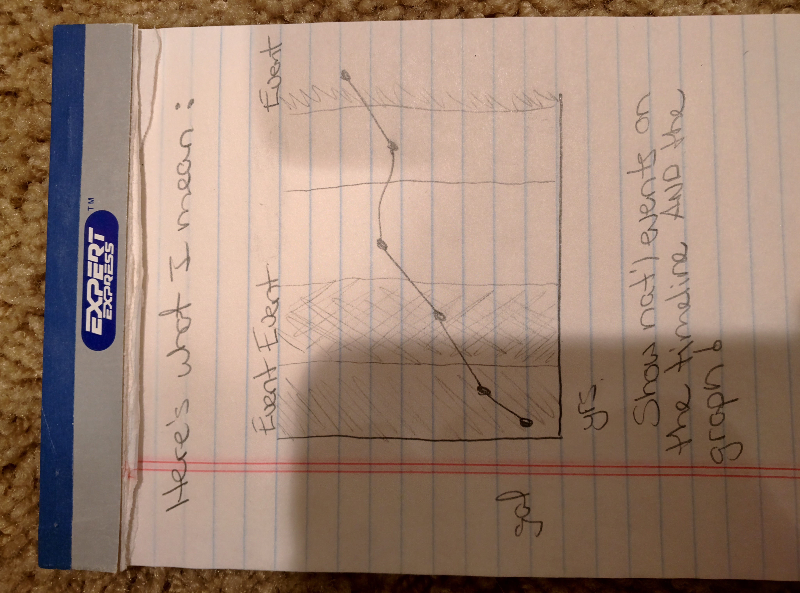
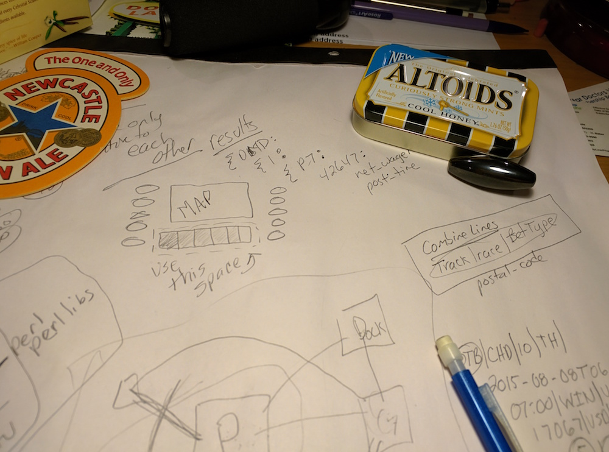
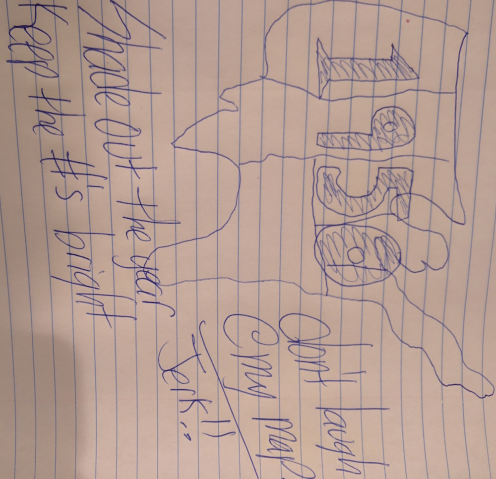
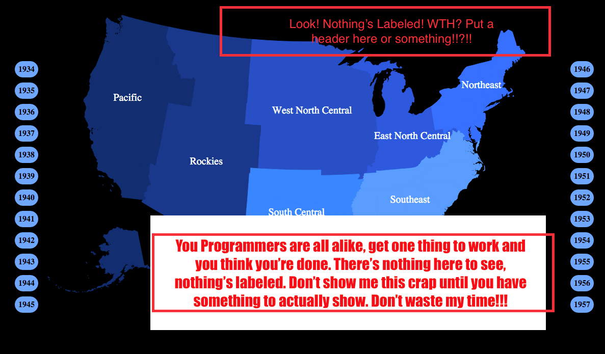
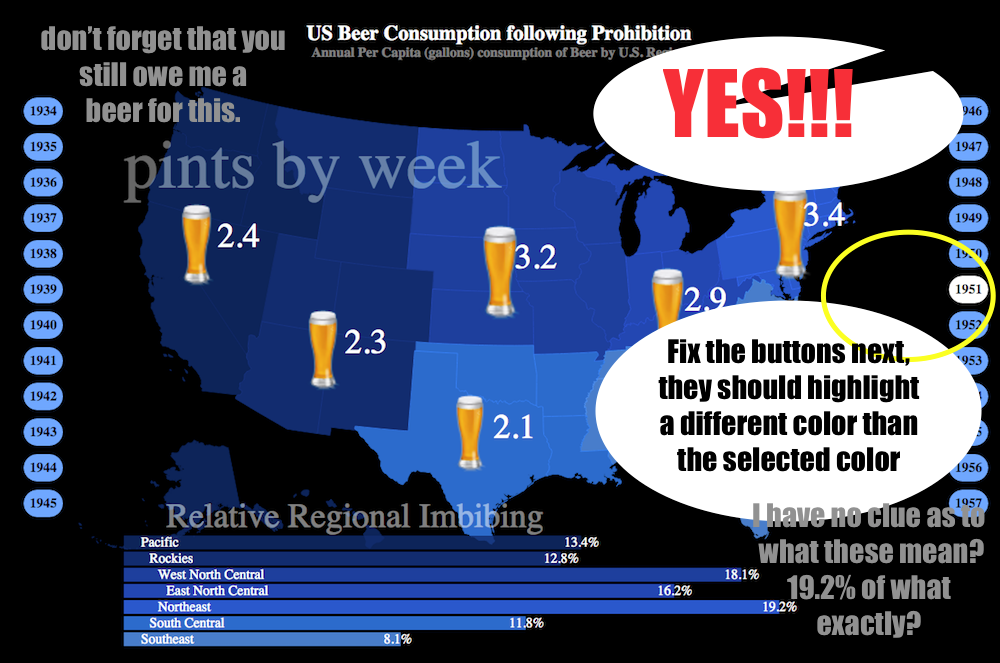

# US Beer Consumption Following Prohibition
#### Annual Per Capita consumption of Beer by U.S. Region

### Author: [Stephen D. Wells](http://stephendwells.com/)
### Live Demo: <http://www.stephendwells.com/beer_after_prohibition/>
### GitHub Repo: <http://github.com/yxes/beer_after_prohibition>

## SECTIONS

* [Summary](#Summary)
* [Design](#Design)
* [Feedback](#Feedback)
* [Resources](#Resources)
* [Motivation](#Motivation)
* [Data Sources](#data)

##  SUMMARY

As the US came out of prohibition, beer consumption per captia
was at it's lowest point. Throughout the Great Depression (-1936)
and all through World War II (1937-1945) consumption rose to it's
most dramatic levels, peaking in 1945. At this point, the average
person in the North Eastern US was consuming over 27 gallons of
beer per year, which is the equivent to over 4 pints every week.

Speaking of the North East, relative to the rest of the regions in
this data set, and in sharp contrast to the South East, they love
their beer.

It's interesting to note that in general, as the US went through
times of crisis (The Great Depression / World War II), we saw a
rise in consumption. Immediately following WWII, we see a drop 
and the regions come closer together in values.

##  DESIGN

[All Design Choices and Changes](http://www.stephendwells.com/beer_after_prohibition/process.html)

### SCATTER PLOT TURNED LINE GRAPH

[LIVE PLOT EXAMPLE](http://www.stephendwells.com/beer_after_prohibition/plot.html)

In order to display the relative consumption patterns at first I 
chose a traditional scatter plot. The X axis being the year and
the Y being the gallons consumed that year. Since I needed to add
the third element (the regions), I opted to distinguish them using
both color and lines. The color legend was ordered to match the display
with the highest beer drinkers on the top and the lowest on the bottom
so it would pair with the graph.

By connecting the points with lines, it was much easier to distingush
the regions and it gave the time values (along the X axis) more emphasis
of the changes. After testing various techniques to add in world events,
I opted to use a light grey rectangle behind the plotted values so as
to not distract from the graph. To reivew exact values, I established 
mouse over events that increase the size of the point while displaying
it's value immediately above it.

**I then scrapped the entire direction of the project and instead
created a map of the US.**

### US REGIONAL MAP

[LIVE MAP EXAMPLE](http://www.stephendwells.com/beer_after_prohibition/index2.html)

Though the tradtional map did a fine job of showing trends and displaying
the details of the data, I felt it was important to express the regions
in a more meaningful way. The new map comes complete with scalable pint
images (by area so the scales are exact), a horizontal bar chart and
a selection plot based on the broad scope of things I learned from the
plot.

Using animation I developed a martini glass structure that follows a
tight narrative early on (the stem) and opens up for free exploration
(the body of the glass) after. These events walk through a vertical 
line chart with the plotted minimum and maximum values, overlaid with
world events. This chart effectively becomes an input device after
the animation completes.

In order to express the differences between regions more effectively,
there's a horizontal bar chart that appears during the readers 
exploratory phase. Mousover events use a splash of color to draw the
eye as a link between the two displays and highlights a given region.

##  FEEDBACK

Several people provided crucial support in the development process and
were instrumental in the direction.

* Anonymous (all four of you)
* Brian Gannon - Network Guru - Austin, TX
* Burton Kent - Professional Nerd - Chicago, IL
* Daniel Emaasit - Ph.D. Research Assistant - Las Vegas, NV
* Geoff Louvar - Website Designer - Witchita, KS
* Jason Schuck - Serial Entrepreneur - Summerlin, NV
* Jenny Smith - Engineer - Waukon, IA
* Luke Saucier - Operations Director - Effingham, NH
* Marcie Wells - lover of all things purple - Cedar Rapids, IA
* Ryan Gormely - SEO master - Las Vegas, NV
* Sara Messier - Digital Artist - Cedar Rapids, IA

As the development process continued, I was able to stop at various points
and get feedback before continuing.

I have provided a 
[direct link](http://www.stephendwells.com/beer_after_prohibition/process.html)
to that process.

### Sketches

Though I did receive some handwritten sketches, most felt that public consumption
of their "artwork" might negatively influence their artistic aspirations.

Here's a couple that we're legible and I was able to get permission to post...

### Screen Shots

I have nothing to say other than that they were both spot on.

##  RESOURCES

Websites, Presentations, Forums and Source Code Links

* [CSS Button Generator](http://css3buttongenerator.com/)
* [D3 Documentation](https://github.com/mbostock/d3/wiki)
* [D3 Map Example](http://bost.ocks.org/mike/map/)
* [JS setInterval function](http://www.w3schools.com/jsref/met_win_setinterval.asp)
* [Paletton: Color Picker](http://paletton.com/)
* [Information is Beautiful: Inspiration and Humility](http://www.informationisbeautiful.net/)
* [Add images with D3](http://stackoverflow.com/questions/14567809/how-to-add-an-image-to-an-svg-container-using-d3-js)
* [D3 Shapes](https://www.dashingd3js.com/svg-basic-shapes-and-d3js)
* [D3 Stacked Bar Chart](http://bl.ocks.org/mbostock/3886208)
* [Animations](http://blog.visual.ly/creating-animations-and-transitions-with-d3-js/)
* [Source Code from Various JFire Animations](http://jfire.io/animations/)
* [Simple Mouse Over Events](http://christopheviau.com/d3_tutorial/)
* [D3 Transitions](http://blog.andreaskoller.com/2014/02/d3-and-ui-animations/)
* [KPeng d3 Presentation](http://kpeng.github.io/d3-workshop/)

##  MOTIVATION

I chose this dataset after learning that the end of prohibition
was really pushed by the states and their need for taxation monies.
Prior to this I was discussing the impact of automated cars with 
a group of friends when it was brought up that traffic tickets are
a major source of revenue for cities and counties. I went looking 
to see how much of an impact when I came across this:

<http://www.statisticbrain.com/driving-citation-statistics/>

Unfortunately, after contacting the NHTSA, I contend that these
results are far two low. I was told that their dataset only
includes state-reported traffic *fatalities*. In other words, this
dataset is only derived when a ticket was written after not just 
an accident but a fatal one at that. Someone should contact the
site and let them know. I would, but their contact form is down
and the site owner isn't returning my emails.

So we can determine that *AT LEAST $6B* in revenue will be lost to
automated cars and states are going to have to find something to 
fill the gap. The end of prohibition brought us beer, what will
the start of automated cars bring?

##  DATA SOURCES

### Beer Consumption

A. M. McGahan. "The Emergence of the National Brewing Oligopoly:
Competition in the American Market, 1933-1958." *The Business History Review*
Vol. 65, No. 2 (Summer, 1991): 229-284. Print.

<http://www.stat.ufl.edu/~winner/data/beerreg.dat>

<http://www.stat.ufl.edu/~winner/data/beerreg.txt>

The original data file **beerreg.dat** held a lot of information that
I wasn't going to use, so I cleaned it up with a small python script
and created, **beerreg.tsv**. In an effort to be reproducible, I put
the script in the [helper_scripts](helper_scripts/) directory.

### Mapping Data

Big Thanks to [Mike Bostock](http://bost.ocks.org/mike/)!

<http://bl.ocks.org/mbostock/raw/4090846/us.json>

<http://bl.ocks.org/mbostock/raw/4090846/us-state-names.tsv>
